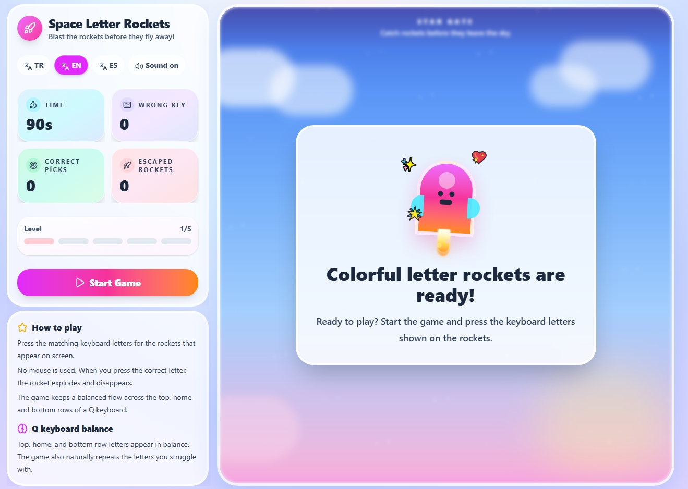

# Letter Code Rockets 🚀

**A free, open-source typing game for kids — with zero data collection.**

Ücretsiz, açık kaynak, çocuklar için harf öğretme oyunu. **Hiçbir veri toplamaz.**



---

## What is this?

Letter Code Rockets is a browser-based typing game designed to help young learners recognize letters and build keyboard confidence. Rockets fly up from the bottom of the screen, each showing a letter. The player must press the matching key before the rocket escapes the top of the screen.

The game is built to be:

- **Educational** — gently adaptive; letters the child struggles with appear more often, while keeping top / home / bottom keyboard rows balanced.
- **Safe for children** — no accounts, no ads, no tracking, no third-party scripts, no cookies. See [PRIVACY.md](PRIVACY.md) for full details.
- **Multilingual** — Turkish (tr), English (en), and Spanish (es) keyboard layouts.
- **Offline-friendly** — once loaded, the game runs entirely in the browser with no network calls.
- **Open source** — licensed under [MIT](LICENSE); contributions are welcome from developers, teachers, parents, and anyone who wants to make it better for kids.

## Why it exists

Most "free" learning apps for children quietly track usage, show ads, or require accounts. This project exists to show that a fun, polished, useful game can be built for children **without** taking anything from them — no data, no attention to ads, no sign-up friction. Parents and teachers should be able to read the source code, verify for themselves what the game does and doesn't do, and trust it.

## How to play

1. Open the game in a browser.
2. Choose a language (TR / EN / ES).
3. Press **Start**.
4. When a rocket appears with a letter on it, press that letter on the keyboard.
5. Hit as many rockets as you can in 90 seconds without letting them escape the top.

No mouse is used during play. The game rewards accuracy and calm typing more than speed.

## Privacy in one line

The game **does not** use cookies, analytics, tracking, ads, user accounts, or network calls. It saves the selected language preference (`tr` / `en` / `es`) to the browser's own `localStorage` so the choice is remembered on the next visit — this value never leaves the device. Full statement: [PRIVACY.md](PRIVACY.md).

## Tech stack

- [React 19](https://react.dev/)
- [Vite](https://vitejs.dev/)
- [Tailwind CSS v4](https://tailwindcss.com/)
- [lucide-react](https://lucide.dev/) for icons
- Web Audio API (sounds are generated in the browser — no audio files are downloaded)

## Running locally

```bash
git clone https://github.com/Engin212/letter-code-rockets.git
cd letter-code-rockets
npm install
npm run dev
```

Then open the URL Vite prints (usually `http://localhost:5173`).

To produce a production build:

```bash
npm run build
npm run preview
```

The built output in `dist/` is a fully static site — it can be hosted on GitHub Pages, Netlify, Vercel, Cloudflare Pages, or any static host, with no backend.

## Contributing

Contributions are welcome, especially:

- **New languages / keyboard layouts** (German, French, Portuguese, Arabic RTL, etc.)
- **Accessibility improvements** (screen reader support, reduced motion, dyslexia-friendly fonts)
- **New difficulty or game modes** that stay true to the "gentle, no-stress" feel
- **Bug reports** from parents and teachers trying it with real kids
- **Translations** of the in-game UI strings

See [CONTRIBUTING.md](CONTRIBUTING.md) for how to file issues and submit pull requests.

## License

[MIT](LICENSE) — you may use, modify, and distribute this freely, including for commercial use. Please keep the copyright notice intact.
